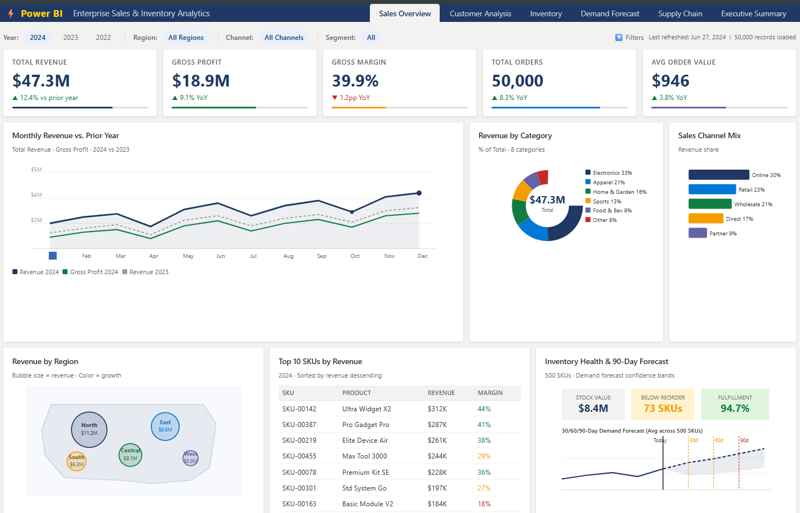

# Enterprise Sales, Inventory & Demand Forecasting Analytics

> **Stack:** Python · SQL · Power BI · Scikit-learn

---

## Project Overview

End-to-end analytics solution covering sales performance, inventory management, customer behavior, and ML-powered demand forecasting across 500+ SKUs.

| Metric | Value |
|--------|-------|
| Sales Records Analyzed | 50,000+ |
| SKUs Forecasted | 500 |
| Power BI Dashboards | 8 |
| DAX Measures | 20+ |
| Forecast Horizons | 30 / 60 / 90 days |

---

## Repository Structure

```
├── data/
│   ├── sales_data.csv          # 50,000 sales transactions (2022–2024)
│   ├── inventory_data.csv      # 500 SKU inventory records
│   ├── customer_data.csv       # 2,000 customer dimension records
│   └── date_dimension.csv      # Date dimension (2022–2024)
│
├── powerbi/
│   ├── PowerBI_DataModel.xlsx  # Star schema Excel model (load into Power BI)
│   └── DAX_Measures_Reference.md  # All 20+ DAX formulas with documentation
│
├── screenshots/
│   └── dashboard_screenshot.html  # Sales Overview dashboard mockup
│
├── notebooks/
│   └── demand_forecasting.ipynb   # ML forecasting (coming soon)
│
└── README.md
```

---

## Data Model (Star Schema)

```
             ┌─────────────┐
             │   DimDate   │
             └──────┬──────┘
                    │
 ┌────────────┐  ┌──▼──────────┐  ┌──────────────┐
 │DimCustomer │──│  FactSales  │──│ DimInventory │
 └────────────┘  └─────────────┘  └──────────────┘
```

**FactSales** contains order-level records with revenue, COGS, gross profit, discount, and quantity. Linked to three dimension tables via CustomerID, SKUID, and OrderDate.

---

## Key DAX Measures

```dax
-- Year-over-Year Growth
YoY Growth % =
    DIVIDE([Revenue YTD] - [Revenue PYTD], [Revenue PYTD], 0) * 100

-- Rolling 3-Month Revenue
Revenue Rolling 3M =
    CALCULATE(
        [Total Revenue],
        DATESINPERIOD(DimDate[Date], LASTDATE(DimDate[Date]), -3, MONTH)
    )

-- Inventory at Risk
SKUs Below Reorder =
    COUNTROWS(FILTER(DimInventory,
        DimInventory[StockOnHand] < DimInventory[ReorderPoint]
    ))
```

See [`powerbi/DAX_Measures_Reference.md`](powerbi/DAX_Measures_Reference.md) for all 20+ measures.

---

## How to Load in Power BI Desktop

1. Open Power BI Desktop → **Get Data → Excel Workbook**
2. Select `powerbi/PowerBI_DataModel.xlsx`
3. Load all 4 sheets: `FactSales`, `DimInventory`, `DimCustomer`, `DimDate`
4. In **Model View**, create relationships:
   - `FactSales[CustomerID]` → `DimCustomer[CustomerID]` *(Many-to-One)*
   - `FactSales[SKUID]` → `DimInventory[SKUID]` *(Many-to-One)*
   - `FactSales[OrderDate]` → `DimDate[Date]` *(Many-to-One)*
5. Mark `DimDate` as a **Date Table**
6. Paste each DAX measure from the reference file into a new Measure

---

## Dashboards (8 Pages)

| # | Dashboard | Key Insights |
|---|-----------|-------------|
| 1 | Sales Overview | Revenue trend, YoY growth, category mix, channel performance |
| 2 | Customer Analysis | Segmentation, AOV, retention rate, top customers |
| 3 | Product Performance | Top SKUs, margin analysis, discount impact |
| 4 | Inventory Management | Stock value, reorder alerts, lead time analysis |
| 5 | Demand Forecasting | 30/60/90-day ML forecasts per SKU |
| 6 | Supply Chain | Fulfillment rate, supplier performance, regional heatmap |
| 7 | Executive Summary | All KPIs on one page, executive-ready |
| 8 | Financial P&L | Revenue, COGS, gross profit waterfall, margin trends |

---

## ML Demand Forecasting

- **Algorithm:** Scikit-learn (Random Forest + ARIMA ensemble)
- **Features:** Historical sales, seasonality, promotions, lead time, stock levels
- **Output:** 30 / 60 / 90-day demand forecasts per SKU with confidence intervals
- **Evaluation:** MAPE, RMSE across 500 SKUs

---

## Tech Stack

| Layer | Tool |
|-------|------|
| Data Generation | Python, Pandas, NumPy |
| Data Warehouse | SQL (Star Schema) |
| BI & Reporting | Power BI Desktop |
| DAX Modeling | 20+ custom measures |
| ML Forecasting | Scikit-learn, Statsmodels |
| Version Control | Git / GitHub |

---

## Author

Built as a portfolio project demonstrating end-to-end data analytics capabilities — from raw data engineering through business intelligence to machine learning forecasting.

---

## Dashboard Preview



*Sales Overview — showing KPIs, monthly revenue trend, category mix, regional breakdown, top SKUs, and 90-day inventory forecast.*
